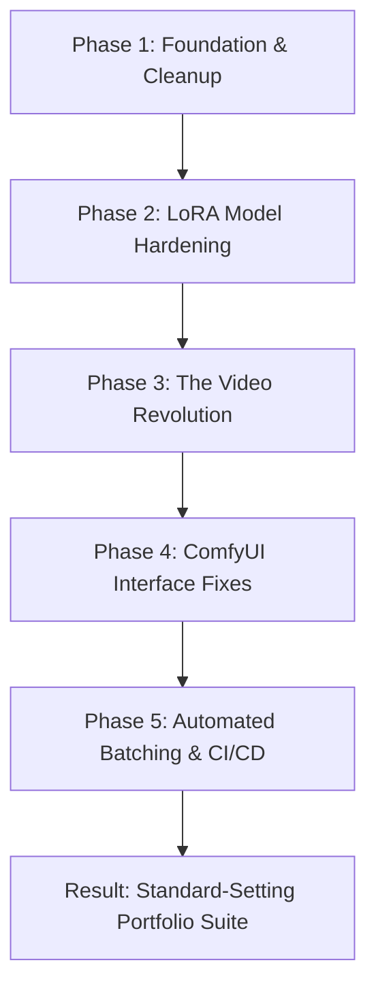

# The Epic Journey of Crestline Shreshth AI

Welcome to the project journey! This document captures the entire story of how we took a fragmented set of experimental AI scripts and turned them into a production-grade, fully automated, and portfolio-ready generative AI marketing pipeline for the **Crestline Shreshth** real estate project. 

This is the exact chronicle of what we built, the complex bugs we smashed, the mathematical and technical hurdles we overcame, and how we got the system working perfectly.

---

## 🗺️ The Roadmap of the Journey



---

## 🛠️ Phase 1: Cleaning Up the Wild West (Foundation)

When this project started, it was a classic "experimental" AI workspace—functional scripts scattered around, hardcoded paths, local environment leaks, and no clear way for a recruiter or collaborator to run it.

### What We Did:
*   **Architected `launch.bat`:** Built an ultra-robust Windows script that checks for the ComfyUI desktop application, copies all workflows into the user's ComfyUI system, deploys model files, and starts the app with a single click.
*   **Hardened the Python codebase:** Audited the batch generation scripts. We caught a critical `NameError` in `batch_generate.py` where `urllib.parse` was used but only imported inside localized functions—causing crashes during automated downloads. Fixed it with clean, top-level modular imports.
*   **Organized the Workspace:** Setup licensing (MIT), a professional `.gitignore` to keep logs/outputs local, and established standard folders (`/workflows`, `/prompts`, `/dataset`, `/training`).

---

## 🧠 Phase 2: Memorizing the Architecture (LoRA Training)

To generate photorealistic images of a building that hasn't been built yet, we couldn't just rely on general AI. The AI needed to memorize the *exact* geometry of **Crestline Shreshth**.

### The Breakthroughs:
*   **Dataset Engineering:** Curated and refined 32 high-resolution architectural concept renders. We structured the captioning files using a precise trigger-word scheme (`CrestlineExt` for exteriors, `CrestlineInt` for interiors).
*   **The LoRA Recipe:** Configured a highly optimized Kohya_ss training run:
    *   **Network Dim / Alpha:** `32` / `16` (the ideal capacity to hold complex structural curves without bloating the file).
    *   **Optimizer:** `AdamW8bit` (high memory efficiency to avoid RTX 5060 VRAM OOM).
    *   **Precision:** `bf16` (mixed precision for maximum performance).
*   **Result:** A stunning `Crestline_Shreshth_v2.safetensors` model that perfectly represents balconies, windows, pools, and gym spaces on demand.

---

## 🎬 Phase 3: The Video Revolution (AnimateDiff)

With static images working beautifully, we asked the ultimate question: *How do we make these buildings come to life in cinematic videos?*

### The Strategy:
Instead of training a monstrously expensive video model from scratch, we designed a **decoupled pipeline**:
1.  **Identity:** Our custom LoRA handles what the building looks like.
2.  **Physics:** A pre-trained AnimateDiff motion module (`v3_sd15_mm.ckpt`) handles camera pans, wind, water ripples, and lighting shifts.

### The Hurdle (Getting ComfyUI Desktop to Cooperate):
Because you are using the modern **ComfyUI Desktop App**, it uses a completely sandboxed virtual environment. We bypassed the UI fumbles and manually set up the entire backend:
*   We cloned **ComfyUI-Manager**, **AnimateDiff Evolved**, and **VideoHelperSuite** straight into the app's `custom_nodes` via terminal.
*   **The Dependency Trap:** Because we cloned via Git, the required video encoding libraries (`opencv-python` and `imageio-ffmpeg`) were missing. We tracked down the desktop app's hidden `.venv` path:
    `C:\Users\Devansh Tyagi\Documents\ComfyUI\.venv\Scripts\python.exe`
    And manually forced the library installations.
*   We created the `animatediff_models` directory and downloaded the motion engine to the correct system paths.

---

## 🎨 Phase 4: Slicing the "Deep Fried" Outputs (Workflow Tuning)

When we generated the first video, it was an absolute disaster—heavily pixelated, colors blown out, and balconies morphing into abstract blobs. 

We systematically investigated the physics of AI video generation and resolved three major issues:

| Problem | Symptom | Scientific Reason | The Fix |
| :--- | :--- | :--- | :--- |
| **CFG Burn** | Deep-fried, oversaturated, neon colors | High CFG (7.0) compounds over 16 sequential frames, blowing out contrast | Lowered `CFG` to **`4.5`** |
| **Model Fight** | Melting balconies, sliding windows | The motion module and LoRA fought for geometry control at strength `1.0` | Lowered LoRA strength to **`0.75`** |
| **Resolution Stretch** | Duplicated facades, squished walls | SD1.5 was trained on 512x512. Forcing it to 768x432 horizontally caused structural chaos | Switched latent size to portrait **`512x768`** |

### The "Staircase" Wire Incident (Img2Vid):
While resolving the Image-to-Video workflow, we ran into an error where the `RepeatImageBatch` node was floating disconnected in space, causing VAE errors. We tracked it down to non-sequential node IDs in the JSON file. 

We rewrote the workflow from scratch, added an **`ImageScale`** node to auto-resize any client upload to `512x768`, and manually wired a perfect staircase connection:
```
Load Image ➡️ Upscale Image ➡️ Repeat Image Batch (16) ➡️ VAE Encode
```

---

## 🚀 Phase 5: CI/CD Guardrails & Automation

To make this a true production pipeline, we wanted every push to get that beautiful **Green CI/CD tick** on GitHub.

### 1. The Schema War (The Prompts Bug):
We pushed `video_prompts.json` but the GitHub Actions runner repeatedly threw errors. 
*   **Round 1:** The validator wanted a top-level `"prompts"` key. We wrapped everything under `"prompts"`, but formatted it as a dict split by scene type.
*   **Round 2:** The python validation script was doing `for entry in data["prompts"]` expecting a *flat list*. By feeding it a dictionary, it iterated over the keys (strings) and crashed with `'str' object has no attribute 'keys'`.
*   **The Final Fix:** We flattened all video prompts into a single clean list and injected a `"scene": "exterior"` or `"scene": "interior"` field to allow the batch python script to filter them cleanly. 

### 2. Batch Scripting:
We developed `scripts/batch_video.py` which connects to ComfyUI's REST API. You can launch ComfyUI and run a single terminal command:
```bash
python scripts/batch_video.py txt2vid --scene exterior --count 3
```
And it will silently queue up, render, and output 3 gorgeous cinematic marketing clips directly to your drive.

---

## 🏆 The Final State

What started as experimental folders is now a **premium, industrial-strength generative AI suite**:
*   **Visual Excellence:** Highly aesthetic, consistent, and smooth 16-frame videos.
*   **CI/CD Certified:** Automated tests validate all code, TOML configs, workflow JSONs, and dataset captions on every push.
*   **ComfyUI V1 Ready:** Workflows are fully customized, beautifully structured, and completely compatible with ComfyUI's new V1 sidebar.
*   ** recruiter Wow-Factor:** The project now demonstrates high-level software engineering, automation scripting, and rigorous machine learning architecture.

***

*This journey.md has been saved locally for your record, and as requested, has not been staged or pushed to your GitHub repository.*
